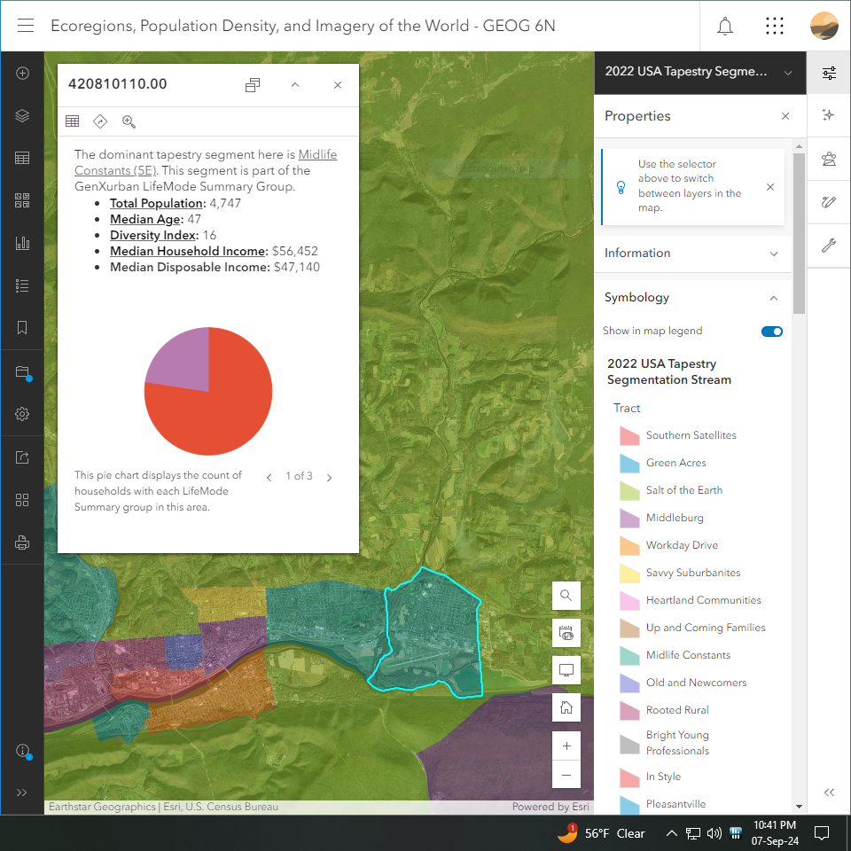

# Schedule

___

### Maps & The Geo-Spatial Revolution (GEOG 6N)

This course focuses on how maps change the way we live our lives, specifically diving into the many useful features of digital mapping software that allow us to visualize information in a spatial setting.

This is a three-credit course for me this semester. Just like STAT 184, there are no set meeting times, so I end up working on it about twice per week, for a few hours at a time.

This map shows different regions and communities of Pennsylvania, separated and color coded based on average observed lifestyle.

[*Geofiction*](https://opengeofiction.net/#map=12/21.1430/84.0162&layers=B) is a community-editable map of fictional setting, using the Open Street Map (OSM) platform.

___

### Reading, Listening, & Writing

Parts of my down-time include reading books, both for personal enjoyment, but also for personal growth. I also tend to read up on subjects that tend to directly benefit my performance at my current job.

I also tend to share any text I find of use to my colleagues, or if I am listening to a speaker at a training or meeting, I will take a fair amount of notes to then distribute to anyone who could use that information.

Some of my reading and listening is also meant to maintain and/or improve my skill of the Spanish language.

I use [*Goodreads*](https://www.goodreads.com/) to track my reads for both personal enjoyment as well as academic/professional development.

I listen to this music nearly every day at some point, and I read nearly every day as well.

___

### Wildlife Photogaphy

Delete this text and tell us about the activity.

